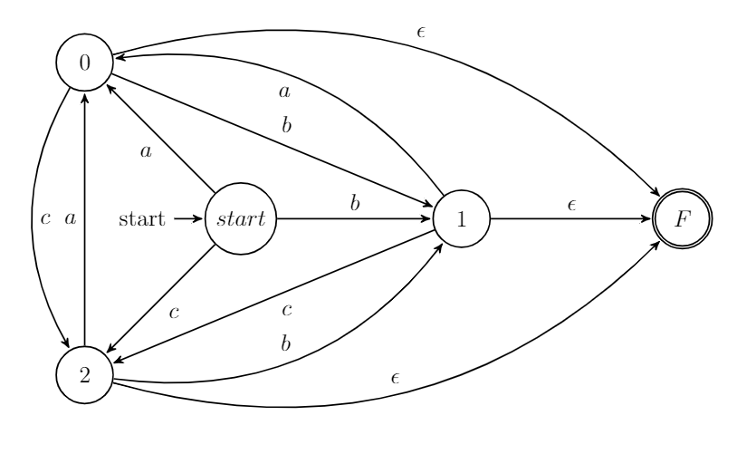
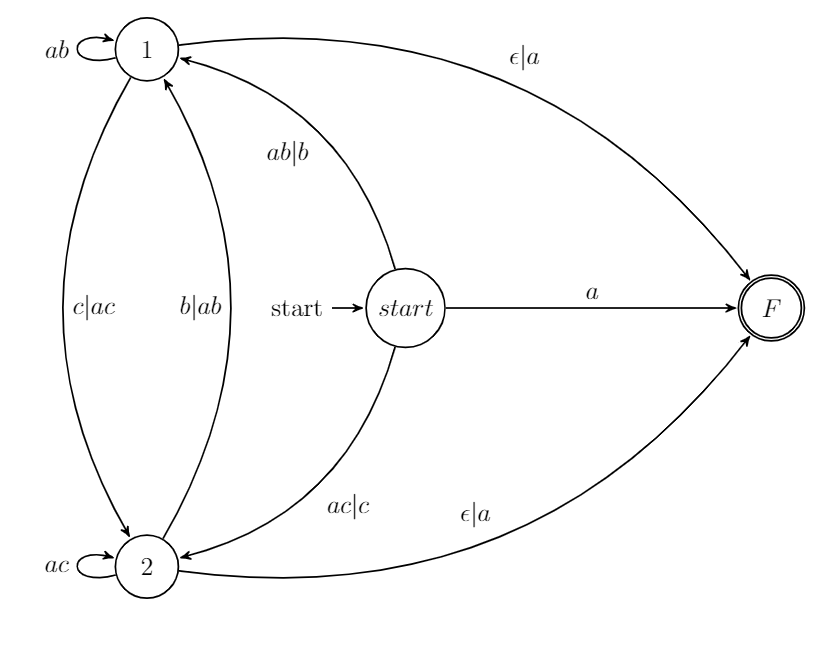
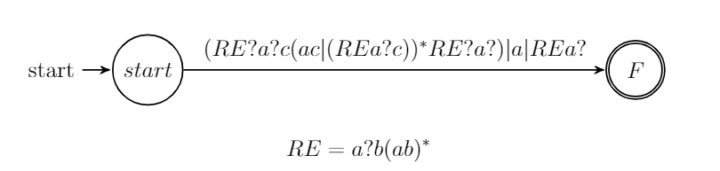
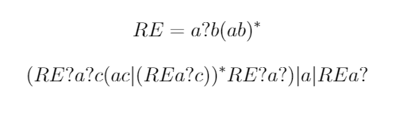

<!--
 * @Github: https://github.com/Certseeds/CS323_Compilers_2020F
 * @Organization: SUSTech
 * @Author: nanoseeds
 * @Date: 2020-09-19 21:47:34
 * @LastEditors: nanoseeds
 * @LastEditTime: 2021-01-04 20:02:04
 * @License: CC-BY-NC-SA_V4_0 or any later version 
 -->

# CS323 Assignment 1

**Scores**: 105/110(only have a few error of Question 2-6)  
**Name**: nanoseeds  
**SID**: \*\*\*\*\*\*\*\*

## Question1

When aCcompiler compiles the following statement, how many tokens will itgenerate?[5 points]

### Answer

`int a3 = a * 3;`
will be analysis to Tokens

``` flex
TYPE int
ID a3
ASSIGN
ID a
MUL
INT 3
SEMI
```

so, it will be analysis to 7 tokens.

## Question 2

In a string of length n(n >0), how many of the following are there?

1. Prefixes[5 points]</br>  
Answer:  
prefixs is a string that delete 0 or multiply characters from string.
so the answer is $n+1$,which begin at delete 0 to delete all n characters.

2. proper prefixes(A proper prefix is prefix of a string which are not $\epsilon$ and not equal to s itself).[5 points]</br>
Answer:  
we know that a proper prefixes is prefixes of a string except the string itself and null. so , the answer is $n-1$.  
PS: the proper prefixes is write as 'true prefixes'.  

3. Prefixes of length m.($0<m≤n$)[5 points]</br>
Answer:  
There only exist one prefix for a const value m of a string length n.  
which means the string delete (m-n) in the backend.  

4. Suffixes of length m.($0<m≤n$)[5 points]</br>
Answer:  
There only exist one suffix for a const value m of a string length n.  
which means the string delete (m-n) in the frontend.  

5. Proper prefixes of length m($0<m≤n$)[10 points]</br>
Answer:  
In this case, we find that if $m==n$,then there do not exist proper prefixes.  
if($0<m<n$), then there exist one proper prefixes.  

6. Substrings(A substring of s is obtained by deleting any prefix and any suffix from s. inlcude itself and $\epsilon$)[10 points]</br>
Answer:  
first of all, Substrings' length range is [0,n].  
second , the length is n, so we can view the string as n char with n+1 blocks, what we should do is do double divide in n+1 blocks, the middle part is the substring.  
so Answer is $\tbinom{n+1}{2}$(select 2 from n+1).  
**Correct Answer: The Answer is  $\tbinom{n+1}{2}+1$**

7. subsequence (A subsequence of s is any string formed by deleting zero or more not necessarily consecutive  positions of s. For example, baan is a subsequence of banana.) [10 points]</br>
Answer:  
first of all, subsequence' length range is [0,n].  
for a subsequence length m, we should delete (m-n) chars in the n characters, which is $\tbinom{n}{n-m}=\tbinom{n}{m}$.(select m from n elements)  
so the sum is $\sum_{m=0}^{n}{\tbinom{n}{m}}=2^{n}$  

ALL in ALL
1-7's answer is

| Order |                                                 Answer |
| :---- | -----------------------------------------------------: |
| 1     |                                                  $n+1$ |
| 2     |                                                  $n-1$ |
| 3     |                                                    $1$ |
| 4     |                                                    $1$ |
| 5     | $\begin{cases}  0, & m==n \\\\ 1, & 0<m<n \end{cases}$ |
| 6     |                                    $\tbinom{n+1}{2}+1$ |
| 7     |                  $\sum_{m=0}^{n}{\tbinom{n}{m}}=2^{n}$ |

## Question 3

Describe the languages denoted by the following regular expressions.[5 points for each]

1. First we simply it.  
$((\epsilon|a)^{*}b^{*})^{*}=(a^{*}b^{*})^{*}$  
PS:$\epsilon$ is guaranteed in a closure  
what's more, we will find that in the text book's page 122(of English version, or Chinese version's page 76, Example3.4's sample 4).The textbook say that $(a|b)^{*} == (a^*b^*)^*$. So the regular expressions will match all strings that construct on characters a or b(and it's length from $0$ to $\infty$)

2. $(a|b)^*a(a|b)(a|b)$  
first because the end part do not have $*$, so the language's min-length is at least 3, which means front-part is zero and backend part is 3.  
and we can descript the language, it's length is at least 3, which third character from last is `a`  and other characters is `a` or `b`.

3. $a^*ba^*ba^*ba^*$  
first, the length is at least 3.  
second, this regular expressions match a string that length > 3, and was a string that construct by 3 `b` and ($0$ to $\infty$) `a`.

## Question 4

Write regular definitions or regular expressions for the following languages.[10 points for each]

1. All strings representing valid telephone numbers in Shenzhen. A valid telephone number contains the country code (86), a hyphen, the area code 0755, another hyphen, and eightdigits where the first one cannot be zero (e.g., 86-0755-88015159).  
Answer:  
`86-0755-[1-9][0-9]{7}`

2. All strings of a's and b's that start with `a` and end with `b`.  
Answer:  
$a(a|b)^{*}b$

3. All strings of lowercase letters that contain the five vowels in order.  
Answer:  
five vowels is `a` `e` `i` `o` `u`  
we define LL -> $[bcdfghjklmnpqrstwvxyz]$  
so the answer is $LL^{*}a(LL|a)^{*}e(LL|e)^{*}i(LL|i)^{*}o(LL|o)^{*}u(LL|u)^{*}$

## Bonus

Suppose we have a alphabet Σ={a,b,c}, write regular definitions to describeall strings over Σ without repeated letters.  [Hint:  You may draw an NFA for the languageand convert the NFA to regular definitions.]

<div>
  <br />
  <div>state1</div>
</div>

first of all, we build a NFA that only have the matches path.

<div>
  <br />
  <div>state2</div>
</div>

then, add the final node of NFA.

<div>
  <br />
  <div>state3</div>
</div>

we delete node 0 and simply graph to state3

<div>
  <br />
  <div>state4</div>
</div>

the next deleted is node 1.

<div>
  <br />
  <div>state5</div>
</div>

finally delete node 2.

<div>
  <br />
  <div>state6</div>
</div>

now it is what we need.  
we use RE -> $a?b(ab)^{*}$  
Answer is  
<div>
  <br />
  <div>Answer</div>
</div>

<link rel="stylesheet" type="text/css" href="./../markdown.css">
