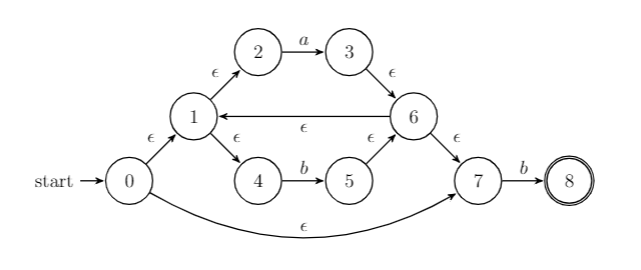
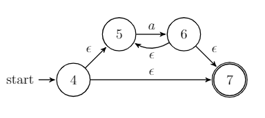

<!--
 * @Github: https://github.com/Certseeds/CS323_Compilers_2020F
 * @Organization: SUSTech
 * @Author: nanoseeds
 * @Date: 2020-09-19 21:47:34
 * @LastEditors: nanoseeds
 * @LastEditTime: 2021-01-04 20:31:16
 * @License: CC-BY-NC-SA_V4_0 or any later version 
 -->

# CS323 Assignment 2

**Scores**: 100/120(Do not convert DFA to simplest)  
**Name**: nanoseeds  
**SID**: \*\*\*\*\*\*\*\*

## Question 1

Design NFAs and DFAs to recognize each of the following regular languages:

1. $L((a|b)^{*}b)$ [10 points]
2. $L(((\epsilon|a)^{*}b)^{*})$ [10 points]
3. $L((a|b)^{*}a(a|b)(a|b))$ [10 points]
4. $L(a^{*}ba^{*}ba^{*}ba^{*})$ [10 points]

## Answer_Of_Question1

   
  
NFA for $L((a|b)^{*}b)$

   
  
DFA for $L((a|b)^{*}b)$

   
  
NFA for $L(((\epsilon|a)^{*}b)^{*})$

   
  
DFA for $L(((\epsilon|a)^{*}b)^{*})$

   
  
NFA for $L((a|b)^{*}a(a|b)(a|b))$

   
  
DFA for $L((a|b)^{*}a(a|b)(a|b))$

   
  
NFA for  $L(a^{*}ba^{*}ba^{*}ba^{*})$

   
  
DFA for  $L(a^{*}ba^{*}ba^{*}ba^{*})$

## Question2 & 3

2: Convert the following regular expressions to NFAs using the Thompson’s
Construction Algorithm (Algorithm 3.23 in the dragon book). Please put down the
detailed steps.

3: Convert the NFAs in Exercise 2 to DFAs using the Subset Construction
Algorithm (Algorithm 3.20 in the dragon book). Please put down the detailed steps. [30
points in total; 10 points for each correct conversion]

PS: to easily write, answer's below is one step to 2 and one step to question-3.

what's more the NFA and DFA for  (a|b)*b is also answered.

## Answer_Of_Question2-3

### $(a|b)^{*}b$

#### Question 2's NFA Part

first, L(r) is equal to r. so to simple L((a|b)\*b) ->(a|b)\*b
then, it can be divide to (a|b)* and b.

sub expression  $r_{1} -> a$ $r_{2} -> b$

so the $N(r_{1})$ is 

   
  
$N(r_{1})$

$N(r_{2})$ is 

   
  
$N(r_{2})$

and then we use the rule $r=s|t$ and let $r_{3} = r_{1}|r_{2}$

$N(r_{3})$ is

   
  
$N(r_{3})$

and let $r_{4} = (r_{3})$ the graph of $N(r_{4})$ is same to $N(r_{3})$ so we do not repeat it again.

$r_{5}$ is $r_{4}*$ so we use the rule $r=s*$ to make $N(r_{5})$ is 

   
  
$N(r_{5})$

and we consider the $r_{6}$, which is another $b$ in the expression, but we should use another NFA.

   
  
$N(r_{6})$

finally, $r_{7}=r_{5}r_{6}$ we use rule $r=st$, we connect the state 7 and 7'.

   
  
$N(r_{7})$

#### Question 3's DFA Part

we use the `Subset Construction Algorithm` to simple the NFA in Question1-NFA  part.

the begin state is $\epsilon$-closure(0), which means begin at 0 and can use $\epsilon$ to connect's nodes. so it is A={0,1,2,4,7}

the input alphabeta is `{a,b}`, so we tag A and calclute $Dtran[A,a]$.

A={0,1,2,4,7} and only 1 state can be transfered by $a$,which is state 3.

so move(A,a) = 3. and the $\epsilon$-closure(3) = {1,2,3,4,6,7}

so we call this is **B** and B=$Dtran[A,a]$=$\epsilon$-closure(move(A,a))=$\epsilon$-closure(3) = {1,2,3,4,6,7}

then we need to get $Dtran[A,b]$

A={0,1,2,4,7} and 2 states can be transfered by $b$, which is state 5 & 8.

so move(A,b) = {5,8}, and the $\epsilon$-closure({5,8}) = {1,2,4,5,6,7,8}

so we call this is **C** and C=$Dtran[A,b]$=$\epsilon$-closure(move(A,b))=$\epsilon$-closure({5,8}) = {1,2,4,5,6,7,8}

at that time,state A is taged,But B and C can be tag.

now we calclute $Dtran[B,a]$

B={1,2,3,4,6,7} and it just reach 3. which will produce state **B**-itself.

now we calclute $Dtran[B,b]$

B={1,2,3,4,6,7} and it can reach {5,8} by $b$. so move(B,b)= {5,8} which will create **C**.

so $Dtran[B,b]$ do not create new state, it is **C**

then we calclute $Dtran[C,a]$

C={1,2,4,5,6,7,8}, it can be transfer to reach 3 by $a$, the $\epsilon$-closure(3) ={1,2,3,4,6,7}, which is **B**

so $Dtran[C,a]$ do not create new state, it is **B**

finally we calclute $Dtran[C,b]$

C={1,2,4,5,6,7,8}, it just reach {5,8}. which will lead to **C**-itself.

finally there only exist 3 state

| NFA state       | DFA state |  $a$  |  $b$ |
| :-------------- | :-------: | :---: | ---: |
| {0,1,2,4,7}     |     A     |   B   |    C |
| {1,2,3,4,6,7}   |     B     |   B   |    C |
| {1,2,4,5,6,7,8} |     C     |   B   |    C |

and then we know the state that have the finish NFA-state 8's DFA state is the final state of DFA. it's **C**

   
  
DFA

 
 
 
 
 
 

### $((\epsilon|a)^{*}b)^{*}$

#### Question 2's NFA Part

first, L(r) is equal to r. so simplify to $((\epsilon|a)^{*}b)^{*}$
then we use rule $(\epsilon|a)^{*}=a^{*}$, so it can be simplify to$(a^{*}b)^{*}$

sub expression  $r_{1} -> a$ $r_{2} -> b$

so the $N(r_{1})$ is

   
  
$N(r_{1})$

   
  
$N(r_{2})$

and then we use the rule $r=s*$ and let $r_{3} = r_{1}^{*}$

$N(r_{3})$ is

   
  
$N(r_{3})$

and let $r_{4} = r_{3}r_{2}$.we use rule $r=st$, so $N(r_{4})$ is

   
  
$N(r_{4})$

$r_{5}$ is $(r_{4})$ so $N(r_{5})$ is same to $N(r_{4})$.

and we consider the $r_{6}$, which is $r_{5}*$,

$N(r_{6})$ is

   
  
$N(r_{5})$

#### Question 3's DFA Part

we use the `Subset Construction Algorithm` to simple the NFA in Question1-NFA  part.

the begin state is $\epsilon$-closure(0), which means begin at 0 and can use $\epsilon$ to connect's nodes. so it is A={0,1,2,4,6}

the input alphabeta is `{a,b}`, so we tag A and calclute $Dtran[A,a]$.

A={0,1,2,4,6} and only 1 state can be transfered by $a$,which is state 3.

so move(A,a) = 3. and the $\epsilon$-closure(3) = {2,3,4}

so we call this is **B** and B=$Dtran[A,a]$=$\epsilon$-closure(move(A,a))=$\epsilon$-closure(3) = {2,3,4}

then we need to get $Dtran[A,b]$

A={0,1,2,4,6} and only 1 state can be transfered by $b$, which is state 5.

so move(A,b) = 5, and the $\epsilon$-closure(5) = {1,2,4,5,6}

so we call this is **C** and C=$Dtran[A,b]$=$\epsilon$-closure(move(A,b))=$\epsilon$-closure(5) = {1,2,4,5,6}

at that time,state A is taged,But B and C can be tag.

now we calclute $Dtran[B,a]$

B={2,3,4} and it can just reach {3}.the $\epsilon$-closure(3) ={2,3,4}, which is **B**-itself.

now we calclute $Dtran[B,b]$

B={2,3,4} and it can reach 5 by $b$. so move(B,b)= 5 and it will lead to state **C**.

then we calclute $Dtran[C,a]$

C={1,2,4,5,6}, it can be transfer to reach 3 by $a$, the $\epsilon$-closure(3) ={2,3,4}, which is **B**.

finally we calclute $Dtran[C,b]$

C={1,2,4,5,6}, it  can be transfer to reach 5 by $b$ the $\epsilon$-closure(3) ={1,2,4,5,6}, which is **C**-itself.

finally there only exist 3 state

| NFA state   | DFA state |  $a$  |  $b$ |
| :---------- | :-------: | :---: | ---: |
| {0,1,2,4,6} |     A     |   B   |    C |
| {2,3,4}     |     B     |   B   |    C |
| {1,2,4,5,6} |     C     |   B   |    C |

But there appear double state that have NFA's finish state-6! so we create a virtual node that just as the finish node **D**

   
  
DFA for $((\epsilon|a)^{*}b)^{*}$

 
 
 
 
 
 

### $(a|b)^{*}a(a|b)(a|b)$

#### Question 2's NFA Part

first, in this part we will use many multiply part, but we will repeat them again and again because they are different nodes.

sub expression  $r_{1} -> a$ $r_{2} -> b$

so the $N(r_{1})$ is

   
  
$N(r_{1})$

$N(r_{2})$ is 

   
  
$N(r_{2})$

and then we use the rule $r=s|t$ and let $r_{3} = r_{1}|r_{2}$

$N(r_{3})$ is

   
  
$N(r_{3})$

and let $r_{4} = (r_{3})$. $N(r_{4})$ is same to $N(r_{3})$.

then we use rule $r=s_{*}$ for $r_{5}=r_{4}*$ so $N(r_{5})$ is

   
  
$N(r_{4})$

$r_{6} -> b$ but we do not use $r_{2}$

$N(r_{6})$ is

   
  
$N(r_{6})$

then $r_{7}$=$r_{5}r_{6}$, then we use rule $r=st$

so $N(r_{7})$ is 

   
  
$N(r_{7})$

sub expression  $r_{8} -> a$ $r_{9} -> b$

so the $N(r_{8})$ is

   
  
$N(r_{8})$

$N(r_{9})$ is 

   
  
$N(r_{9})$

and then we use the rule $r=s|t$ and let $r_{10} = r_{8}|r_{9}$

$N(r_{10})$ is

   
  
$N(r_{10})$

and let $r_{11} = (r_{10})$. $N(r_{11})$ is same to $N(r_{10})$.

then let $r_{12}$ = $r_{7}r_{11}$

so $N(r_{12})$ is

   
  
$N(r_{12})$

sub expression  $r_{13} -> a$ $r_{14} -> b$

so the $N(r_{13})$ is

   
  
$N(r_{13})$

$N(r_{14})$ is 

   
  
$N(r_{14})$

and then we use the rule $r=s|t$ and let $r_{15} = r_{13}|r_{14}$

$N(r_{15})$ is

   
  
$N(r_{15})$

and let $r_{16} = (r_{15})$. $N(r_{16})$ is same to $N(r_{15})$.

then let $r_{17}$ = $r_{12}r_{16}$

so $N(r_{17})$ is

   
  
$N(r_{17})$

#### Question 3's DFA Part

we use the `Subset Construction Algorithm` to simple the NFA in Question1-NFA  part.

the begin state is $\epsilon$-closure(0), which means begin at 0 and can use $\epsilon$ to connect's nodes. so it is A={0,1,2,4,7}

the input alphabeta is `{a,b}`, so we tag A and calclute $Dtran[A,a]$.

A={0,1,2,4,7} and 2 states can be transfered by $a$,which is state {3,8}.

so move(A,a) = {3,8}. and the $\epsilon$-closure({3,8}) = {1,2,3,4,6,7,8,9,11}

so we call this is **B** and B=$Dtran[A,a]$=$\epsilon$-closure(move(A,a))=$\epsilon$-closure({3,8}) = {1,2,3,4,6,7,8,9,11}

then we need to get $Dtran[A,b]$

A={0,1,2,4,7} and only 1 state can be transfered by $b$, which is state 5.

so move(A,b) = 5, and the $\epsilon$-closure(5) = {1,2,4,5,6,7}

so we call this is **C** and C=$Dtran[A,b]$=$\epsilon$-closure(move(A,b))=$\epsilon$-closure(5) = {1,2,4,5,6,7}

at that time,state A is taged,But B and C can be tag.

now we calclute $Dtran[B,a]$

B={1,2,3,4,6,7,8,9,11} and 3 states can be transfered by $a$, which is state {3,8,10}.

so move(B,a) = {3,8,10}, and the $\epsilon$-closure({3,8,10}) = {1,2,3,4,6,7,8,9,10,11,13,14,16}

so we call this is **D** and D=$Dtran[B,a]$=$\epsilon$-closure(move(B,a))=$\epsilon$-closure({3,8,10}) = {1,2,3,4,6,7,8,9,10,11,13,14,16}

now we calclute $Dtran[B,b]$

B={1,2,3,4,6,7,8,9,11} and it can reach {5,12} by $b$. 

so move(B,b)= {5,12} and the $\epsilon$-closure({5,12})={1,2,4,5,6,7,12,13,14,16}

si we call this is **E** and E=$Dtran[B,b]$=$\epsilon$-closure(move(B,b))=$\epsilon$-closure({5,12}) = {1,2,4,5,6,7,12,13,14,16}

then we calclute $Dtran[C,a]$

C={1,2,4,5,6,7}, it can be transfer to reach {3,8} by $a$.

so move(C,a) = {3,8}, this state is **B**

then we calclute $Dtran[C,b]$

C={1,2,4,5,6,7}, it can just reach 5 by $b$. so it just produce **C**-itself.

then we calclute $Dtran[D,a]$

D= {1,2,3,4,6,7,8,9,10,11,13,14,16} so it can reach {3,8,10,15} by $a$.

so move(D,a) = {3,8,10,15}, and $\epsilon$-closure({3,8,10,15}) = {1,2,3,4,6,7,8,9,10,11,13,14,15,16,18}

so we call this is **F1**

then we calclute $Dtran[D,b]$

D= {1,2,3,4,6,7,8,9,10,11,13,14,16}, it can reach {5,12,17} by $b$.

so move(D,b) = {5,12,17} and $\epsilon$-closure({5,12,17}) = {1,2,4,5,6,7,12,13,14,16,17,18} is **F2**

then we calclute $Dtran[E,a]$

E={1,2,4,5,6,7,12,13,14,16}, it can reach {3,8,15} by $a$.

so move(E,a) = {3,8,15} and the $\epsilon$-closure(move(E,a))=$\epsilon$-closure({3,8,15}) = {1,2,3,4,6,7,8,9,11,15,18}

we call this state is **F3**=$\epsilon$-closure(move(E,a))=$\epsilon$-closure({3,8,15}) =  {1,2,3,4,6,7,8,9,11,15,18}

then we calclute $Dtran[E,b]$

E={1,2,4,5,6,7,12,13,14,16}, it can reach {5,17} by $b$.

so move(E,b) ={5,17} $\epsilon$-closure({5,17}) = {1,2,4,5,6,7,17,18}

we call this state is **F4**=$\epsilon$-closure({5,17}) = {1,2,4,5,6,7,17,18}

then we calclute $Dtran[F1,a]$.

F1={1,2,3,4,6,7,8,9,10,11,13,14,15,16,18},it reach {3,8,10,15} by $a$. so it produce itself.

then we calclute $Dtran[F1,b]$.

F1={1,2,3,4,6,7,8,9,10,11,13,14,15,16,18},it reach {5,12,17} by $b$. which is **F2**

then we calclute $Dtran[F2,a]$.

F2={1,2,4,5,6,7,12,13,14,16,17,18},it reach {3,8,15} by $a$. so it produce **F3**

then we calclute $Dtran[F2,b]$.

F2={1,2,4,5,6,7,12,13,14,16,17,18},it reach {5,17} by $b$. which is **F4**

then we calclute $Dtran[F3,a]$.

F3={1,2,3,4,6,7,8,9,11,15,18},it reach {3,8,10} by $a$. so it produce **D**

then we calclute $Dtran[F3,b]$.

F3={1,2,3,4,6,7,8,9,11,15,18},it reach {5,12} by $b$. which is **E**

then we calclute $Dtran[F4,a]$.

F4={1,2,4,5,6,7,17,18},it reach {3,8} by $a$. so it produce **B**

then we calclute $Dtran[F4,b]$.

F4={1,2,4,5,6,7,17,18},it reach {5} by $b$. which is **C**

finally there only exist 8 state

| NFA state                              | DFA state |  $a$  |  $b$ |
| :------------------------------------- | :-------: | :---: | ---: |
| {0,1,2,4,7}                            |     A     |   B   |    C |
| {1,2,3,4,6,7,8,9,11}                   |     B     |   D   |    E |
| {1,2,4,5,6,7}                          |     C     |   B   |    C |
| {1,2,3,4,6,7,8,9,10,11,13,14,16}       |     D     |  F1   |   F2 |
| {1,2,4,5,6,7,12,13,14,16}              |     E     |  F3   |   F4 |
| {1,2,3,4,6,7,8,9,10,11,13,14,15,16,18} |    F1     |  F1   |   F2 |
| {1,2,4,5,6,7,12,13,14,16,17,18}        |    F2     |  F3   |   F4 |
| {1,2,3,4,6,7,8,9,11,15,18}             |    F3     |   D   |    E |
| {1,2,4,5,6,7,17,18}                    |    F4     |   B   |    C |

there are four end state.

   
  
DFA for $(a|b)^{*}a(a|b)(a|b)$

 
 
 
 
 
 

### $a^{*}ba^{*}ba^{*}ba^{*}$

#### Question 2's NFA Part

first we make four express $r_{1}$,$r_{2}$,$r_{3}$,$r_{4}$. all of them express a but in different position.

and three expression $r_{5}$,$r_{6}$,$r_{7}$, all of them express b but in different position.

so $N(r_{1})$, $N(r_{2})$, $N(r_{3})$, $N(r_{4})$,$N(r_{5})$, $N(r_{6})$, $N(r_{7})$

   
  
$N(r_{1})$

   
  
$N(r_{2})$

   
  
$N(r_{3})$

   
  
$N(r_{4})$

   
  
$N(r_{5})$

   
  
$N(r_{6})$

   
  
$N(r_{7})$

and we use rule $r=s^{*}$ for $r_{1}$,$r_{2}$,$r_{3}$,$r_{4}$,transfer them to $r_{8}$,$r_{9}$,$r_{10}$,$r_{11}$
that $r_{n+7}$ = $rn^*$(n=1,2,3,4)

and let $r_{n+4}$ = $(r_{n})$(n=8,9,10,11)

   
  
$N(r_{8})$,$N(r_{12})$

   
  
$N(r_{9})$,$N(r_{13})$

   
  
$N(r_{10})$,$N(r_{14})$

   
  
$N(r_{11})$,$N(r_{15})$

and then we connect the $r_{12}$,$r_{13}$,$r_{14}$,$r_{15}$ and $r_{5}$,$r_{6}$,$r_{7}$,
and let $r_{16}$ = $r_{12}r_{5}r_{13}r_{6}r_{14}r_{7}r_{15}$

   
  
$r_{16}$

#### Question 3's DFA Part

we use the `Subset Construction Algorithm` to simple the NFA in Question1-NFA  part.

the begin state is $\epsilon$-closure(0), which means begin at 0 and can use $\epsilon$ to connect's nodes. so it is A={0,1,3}

the input alphabeta is `{a,b}`, so we tag A and calclute $Dtran[A,a]$.

A={0,1,3} and only 1 state can be transfered by $a$,which is state 2.

so move(A,a) = 2. and the $\epsilon$-closure(2) = {1,2,3}
so we call this is **B** and B=$Dtran[A,a]$=$\epsilon$-closure(move(A,a))=$\epsilon$-closure(3) = {1,2,3}

then we need to get $Dtran[A,b]$

A={0,1,3} and only 1 state can be transfered by $b$, which is state 4.

so move(A,b) = 4, and the $\epsilon$-closure(4) = {4,5,7}

so we call this is **C** and C=$Dtran[A,b]$=$\epsilon$-closure(move(A,b))=$\epsilon$-closure({5,8}) = {4,5,7}

at that time,state A is taged,But B and C can be tag.

now we calclute $Dtran[B,a]$

B={1,2,3} and it can not use $a$ to reach more state. so it do not produce new state, it just produce itself.

now we calclute $Dtran[B,b]$

B={1,2,3} and it can only reach 4 by $b$.which will produce **C**.

so $Dtran[B,b]$ do not create new state, it is **C**

now we calclute $Dtran[C,a]$

C={4,5,7} can only reach 6. $\epsilon$-closure(6) = {5,6,7}

then we call this is **D** and D=$Dtran[C,a]$=$\epsilon$-closure(move(C,a))=$\epsilon$-closure(6) = {5,6,7}

now we calclute $Dtran[C,b]$

C={4,5,7} and it can only reach 8 by $b$. so move(C,b)=8

$\epsilon$-closure(move(D,b))=$\epsilon$-closure(8)={8,9,11}

then we call this is **E** and E=$Dtran[C,b]$=$\epsilon$-closure(move(C,b))=$\epsilon$-closure(8) = {8,9,11}

now we calclute $Dtran[D,a]$

D={5,6,7} and it can just reach itself.

now we calclute $Dtran[D,b]$

D={5,6,7} and it can reach 8 which is state **E**

now we calclute $Dtran[E,a]$

E={8,9,11} and it can reach 10 by $a$.

so move(E,a)=10 and $\epsilon$-closure(10) = {9,10,11}

we call this state **F**=$\epsilon$-closure(move(E,a))=$\epsilon$-closure(10)={9,10,11}

then we calclute $Dtran[E,b]$

E={8,9,11} and it can reach 12 by $b$

so move(E,b) = 12 and $\epsilon$-closure(12) = {12,13,15}

we call this state **G**=$\epsilon$-closure(move(E,b))=$\epsilon$-closure(12)={12,13,15}

noe we calclute $Dtran[F,a]$

F={9,10,11} and it can reach just it self.

now we calclute $Dtran[F,b]$

F={9,10,11} and it can just reach one node 12. which will produce state **G**

now we calclute $Dtran[G,a]$

G={12,13,15} and it can reach 14 by $a$.

so move(G,a)=14. $\epsilon$-closure(14) ={13,14,15}

we call this state **H**=$\epsilon$-closure(move(G,a))=$\epsilon$-closure(14)={13,14,15}

now we calclute $Dtran[G,b]$

G={12,13,15} and it can just reach itself.

now we calclute $Dtran[H,a]$

H={13,14,15} so move(H,a) = {14}, and it is state **H**

now we calclute $Dtran[H,b]$

H={13,14,15} so move(H,b) = None. it can not reach any state.

   
  
DFA of $a^{*}ba^{*}ba^{*}ba^{*}$

so we  call it new state **I**=$\epsilon$-closure(move(H,a))=$\epsilon$-closure({15})={15}

| NFA state  | DFA state |   a   |    b |
| :--------- | :-------: | :---: | ---: |
| {0,1,3}    |     A     |   B   |    C |
| {1,2,3}    |     B     |   B   |    C |
| {4,5,7}    |     C     |   D   |    E |
| {5,6,7}    |     D     |   D   |    E |
| {8,9,11}   |     E     |   F   |    G |
| {9,10,11}  |     F     |   F   |    G |
| {12,13,15} |     G     |   H   | None |
| {13,14,15} |     H     |   H   | None |

<link rel="stylesheet" type="text/css" href="./../markdown.css">
