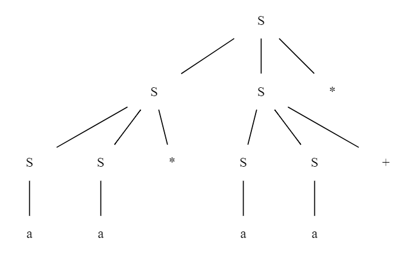
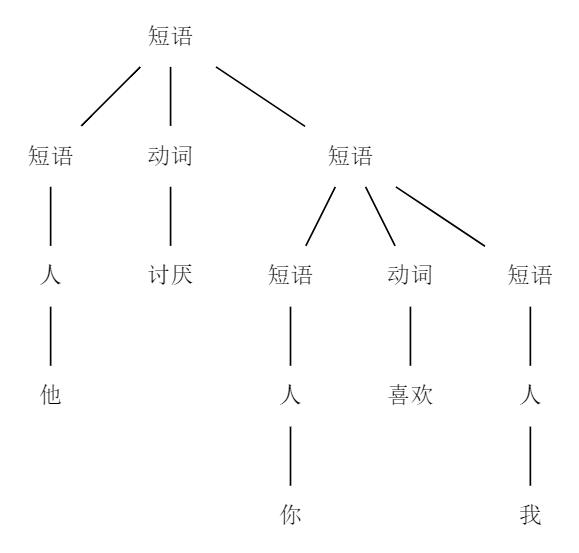
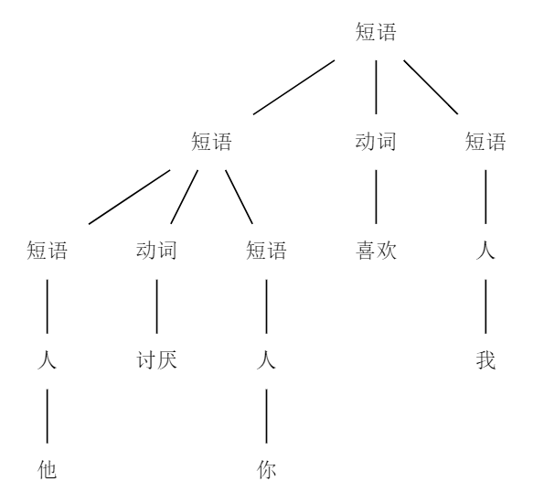

<!--
 * @Github: https://github.com/Certseeds/CS323_Compilers_2020F
 * @Organization: SUSTech
 * @Author: nanoseeds
 * @Date: 2020-10-18 20:22:02
 * @LastEditors: nanoseeds
 * @LastEditTime: 2020-10-18 20:49:06
 * @License: CC-BY-NC-SA_V4_0 or any later version 
 -->

# CS323 Assignment 3

**Scores**: 120/120
**Name**: nanoseeds  
**SID**: \*\*\*\*\*\*\*\*

## Question 1 (Grammar Basics):

Consider the following context-free grammar $G$:
$$S \to SS+ \mid SS* \mid a$$

1. Is the string $a+a*a$ in L(G)? [10 points]
2. Give a leftmost derivation for the string $aa*aa+*$ . [10 points]
3. Give a rightmost derivation for the string $aa*aa+*$. [10 points]
4. Give a parse tree for the string $aa*aa+*$. [10 points]
5. Give an equivalent grammar without immediate left recursions. [10 points]

## Answer_of_Question1

1. no, there do not exist a derivation that can produce it.  
    the reason is that if the grammer use any rule that use $+$ or $*$, then it must finish in $+$ or $*$. but in the string $a+a*a$, it finish in $a$, do not exist any rule can produce this derivation.

2. $S \xRightarrow[\text{lm}]{} SS* \xRightarrow[\text{lm}]{} SS*S* \xRightarrow[\text{lm}]{}aS*S*\xRightarrow[\text{lm}]{}aa*S*\xRightarrow[\text{lm}]{}aa*SS+*\xRightarrow[\text{lm}]{}aa*aS+*\xRightarrow[\text{lm}]{}aa*aa+*$

3. $S \xRightarrow[\text{rm}]{} SS* \xRightarrow[\text{rm}]{} SSS+* \xRightarrow[\text{rm}]{}SSa+*\xRightarrow[\text{rm}]{}Saa+*\xRightarrow[\text{rm}]{}SS*aa+*\xRightarrow[\text{rm}]{}Sa*aa+*\xRightarrow[\text{rm}]{}aa*aa+*$

4. graph

   
  
parse tree for $aa*aa+*$

5. first we write the grammer as 
$$S \to SS+ \mid SS* \mid a$$
then replace them as
$$S \to aS'$$
$$S' \to S+S'\mid S*S'\mid \epsilon$$

## Question 2 (Top-Down Parsing):

Consider the following grammar $G$:
$$S \to aB$$
$$B \to S+B \mid  \epsilon$$

1. Construct the predictive parsing table for $G$. Please put down the detailed
steps, including the calculation of $FIRST$ and $FOLLOW$ sets. [25 points]
2. Is the grammar $LL(1)$? [5 points]
3. Can an $LL(1)$ parser accept the input string aaaa+++? If yes, please list the
moves made by the parser; otherwise, state the reason. Before parsing, please
resolve conflicts in the parsing table if any. [20 points]

## Answer_of_Question2

### Subquestion 1

1. the input signs can only include $+$ $a$ $\$$,the Non-terminal symbol include $S$ $B$
so we can build a table

<table>
  <thead>
    <tr>
      <th rowspan="2">Non-terminal symbol</th>
      <th colspan="3">input symbol</th>
    </tr>
    <tr>
      <th>a</th>
      <th>+</th>
      <th>$</th>
    </tr>
  </thead>
  <tbody>
    <tr>
      <th>S</th>
      <td></td>
      <td></td>
      <td></td>
    </tr>
    <tr>
      <th>B</th>
      <td></td>
      <td></td>
      <td></td>
    </tr>
  </tbody>
</table>

1. $FIRST(a)$=a,$FIRST(+)$=+
2. S is a non-terminal symbol,$S \to aB$,for a,$FIRST(a)$=a,but $FIRST(B)$ is not decided.
3. so we calclute $FIRST(B)$,B is a non-terminal symbol, $B \to S+B \mid \epsilon$, so $FIRST(B)$ at least include $\epsilon$.
4. so $FIRST(B)$ include $\epsilon$, $FIRST(S)$={a}.
5. then we calclute $FIRST(B)$ itself. B is a non-terminal symbol, $B \to S+B \mid \epsilon$, so $FIRST(B)$ at least include $\epsilon$. then $FIRST(S)$={a},but $FIRST(+)$ do not include $\epsilon$, so it do not need to add others.  

in conclusion $FIRST(S)$={a},$FIRST(B)$={a,$\epsilon$}

1. S is the begining symbol, so $FOLLOW(S)$ include $\$$.
2. because there exist a production $S \to aB$, so all element in $FOLLOW(S)$ in $FOLLOW(B)$  
3. because there exist a production $B \to S+B$,so $FOLLOW(S)$ include +
4. after all, $FOLLOW(S)$={$\$$,+}, $FOLLOW(B)$=$FOLLOW(S)$={$\$$,+}

in conclusion, $FOLLOW(B)$=$FOLLOW(S)$={$\$$,+}

1. for $S \to aB$, $FIRST(aB)$=$FIRST(a)$=a, so add $S \to aB$ in $M[S,a]$
2. for $B \to S+B$, $FIRST(S+B)$=$FIRST(S)$=a, so add $B \to S+B$ in $M[B,a]$
3. for $B \to \epsilon$, the right part is $\epsilon$, so each non-terminal symbol(+) and $\$$ in $FOLLOW(B)$. add $B \to \epsilon$ to $M[B,\$]$ and $M[B,+]$ .

| Non-terminal symbol | Input symbols |                  |                  |
| :-----------------: | :-----------: | :--------------: | :--------------: |
|                     |       a       |        +         |       $\$$       |
|          S          |  $S \to aB$   |                  |                  |
|          B          |  $B \to S+B$  | $B \to \epsilon$ | $B \to \epsilon$ |

### Subquestion 2

first ,there only exist one production that has the format $A \to \alpha \mid \beta$,which is $B \to S+B \mid \epsilon$,in there, only one of them is empty, no any symbol can product the different production. and $\beta$ is $\epsilon$ and $\alpha$ is $S+B$ and $S$ is never empty.

so it is a $LL(1)$ grammar.

### Subquestion 3

| had  get |        stack         |    input    |         action          |
| :------- | :------------------: | :---------: | :---------------------: |
|          |        S$\$$         | aaaa+++$\$$ |                         |
|          |        aB$\$$        | aaaa+++$\$$ |    output $S \to aB$    |
| a        |        B$\$$         | aaa+++$\$$  |         match a         |
| a        |       S+B$\$$        | aaa+++$\$$  |   output $B \to S+B$    |
| a        |       aB+B$\$$       | aaa+++$\$$  |    output $S \to aB$    |
| aa       |       B+B$\$$        |  aa+++$\$$  |         match a         |
| aa       |      S+B+B$\$$       |  aa+++$\$$  |   output $B \to S+B$    |
| aa       |      aB+B+B$\$$      |  aa+++$\$$  |    output $S \to aB$    |
| aaa      |      B+B+B$\$$       |  a+++$\$$   |         match a         |
| aaa      |     S+B+B+B$\$$      |  a+++$\$$   |   output $B \to S+B$    |
| aaa      |     aB+B+B+B$\$$     |  a+++$\$$   |    output $S \to aB$    |
| aaaa     |     B+B+B+B$\$$      |   +++$\$$   |         match a         |
| aaaa     | $\epsilon$+B+B+B$\$$ |   +++$\$$   | output $B \to \epsilon$ |
| aaaa     |      +B+B+B$\$$      |   +++$\$$   |   $\epsilon$ to empty   |
| aaaa+    |      B+B+B$\$$       |   ++$\$$    |         match +         |
| aaaa+    |  $\epsilon$+B+B$\$$  |   ++$\$$    | output $B \to \epsilon$ |
| aaaa+    |       +B+B$\$$       |   ++$\$$    |   $\epsilon$ to empty   |
| aaaa++   |       B+B$\$$        |    +$\$$    |         match +         |
| aaaa++   |   $\epsilon$+B$\$$   |    +$\$$    | output $B \to \epsilon$ |
| aaaa++   |        +B$\$$        |    +$\$$    |   $\epsilon$ to empty   |
| aaaa+++  |        B$\$$         |    $\$$     |         match +         |
| aaaa+++  |    $\epsilon$$\$$    |    $\$$     | output $B \to \epsilon$ |
| aaaa+++  |         $\$$         |    $\$$     |   $\epsilon$ to empty   |

so $LL(1)$ parser accept the input string $aaaa+++$

## Question 3 (Bonus):

Consider the following context-free grammar:

$$短语 \to 人 \mid 短语 动词 短语$$
$$动词 \to 喜欢 \mid 讨厌$$
$$人 \to 你 \mid 我 \mid 他$$

The grammar can produce sentences such as “我喜欢你”. Is the grammar ambiguous? If yes, please give one sentence and its multiple parse trees. If no, state
the reason. [5 points for the yes/no answer and 15 points for the justification]

## Answer_of_Question3

For example, the sentence "他讨厌你喜欢我"

   
  
parser tree 1st for "他讨厌你喜欢我"

 
 

   
  
parser tree 2nd for "他讨厌你喜欢我"

the grammer is ambiguous, and the graph shows double trees.

