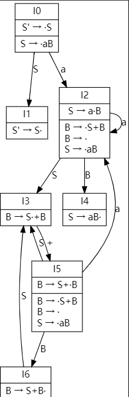

<!--
 * @Github: https://github.com/Certseeds/CS323_Compilers_2020F
 * @Organization: SUSTech
 * @Author: nanoseeds
 * @Date: 2020-10-30 22:42:41
 * @LastEditors: nanoseeds
 * @LastEditTime: 2020-10-31 18:48:23
 * @License: CC-BY-NC-SA_V4_0 or any later version 
 -->

# CS323 Assignment 4: Bottom-Up Parsing Exercises

**Name**: nanoseeds  
**SID**: \*\*\*\*\*\*\*\*

## Question 1 (Simple LR):

Consider the following  grammar $G$:
$$S \to {\alpha}B$$
$$B \to S+B \mid \epsilon$$

1. Construct the SLR(1) parsing table for $G$. Please put down the detailed steps, including
the calculation of LR(0) item sets. [20 points]
2. Is the grammar SLR(1)? [10 points]
3. Can the SLR(1) parser accept the input string aaaa+++? If yes, please list the moves
made by the parser; otherwise, state the reason. Before parsing, please resolve conflicts
if any. [10 points]

## Answer_of_Question1

1. the augmented grammer of Question 1 is 
$$S' \to S$$
$$S \to {\alpha}B$$
$$B \to S+B $$
$$B \to \epsilon$$

now we construct the items sets.

$I_0 = CLOSURE({S' \to \cdot S}) =  \{S' \to \cdot S,S \to \cdot \alpha B\}$

$I_1 = GOTO(I_0,S) = CLOSURE(\{S' \to S \cdot\})= \{S' \to S  \cdot\}$

$I_2 = GOTO(I_0,a) = CLOSURE(\{S \to \alpha \cdot B\})= \{S \to \alpha \cdot B,B \to \cdot S+B,B \to \cdot, S \to \cdot aB \}$

$GOTO(I_0,B) = CLOSURE(\{\})= \{\}$

$GOTO(I_0,+)$ can  not produce new item set.

In $I_1$, there do not have any next to accept except $\$$, so do not need to calclute the next.

$I_3 = GOTO(I_2,S) = CLOSURE(\{B \to S \cdot + B \}) =\{B \to S \cdot + B \}$ 

$GOTO(I_2,a) = CLOSURE(\{S \to \alpha \cdot B\}) = I_2$

$I_4 = GOTO(I_2,B) = CLOSURE(\{S \to \alpha B \cdot \}) = \{S \to \alpha B \cdot \}$

$GOTO(I_2,+)$ can not produce new item set.

$GOTO(I_3,S),GOTO(I_3,\alpha),GOTO(I_3,B)$ can not produce new item sets.

$I_5 = GOTO(I_3,+) = CLOSURE(\{B \to S+ \cdot B\}) = \{B \to S+ \cdot B,B \to \cdot S+B,B \to \cdot, S \to \cdot aB \}$

$I_4$ can not produce more item sets.

$GOTO(I_5,S) = CLOSURE(\{B \to S \cdot +B\}) = I_3$

$GOTO(I_5,\alpha) = CLOSURE(\{S \to a \cdot B\}) = I_2$ 

$GOTO(I_5,+)$ do not produce new item sets.

$I_6 = GOTO(I_5,B) = CLOSURE(\{B \to S+B \cdot\}) = \{B \to S+B \cdot\}$

$GOTO(I_6,\alpha),GOTO(I_6,B),GOTO(I_6,+),GOTO(I_6,S)$ do not produce new items

   
  
graph for Item set specification family

the FOLLOW function is below

$$FOLLOW(S')=FOLLOW(B)=FOLLOW(S)=\{\$,+\}$$

now we use the Item set specification family ,GOTO() and FOLLOW functions to produce the build the SLR(1) parsing table.

| 状态  | Action:$\alpha$ | Action:$+$ | Action:$\$$ | GOTO:$S'$ | GOTO:$S$ | GOTO:$B$ |
| :---: | :-------------: | :--------: | :---------: | :-------: | :------: | :------: |
| $I_0$ |       S2        |            |             |           |    1     |          |
| $I_1$ |                 |            |     acc     |           |          |          |
| $I_2$ |       S2        |     R4     |     R4      |           |    3     |    4     |
| $I_3$ |                 |     S5     |             |           |          |          |
| $I_4$ |                 |     R2     |     R2      |           |          |          |
| $I_5$ |       S2        |     R4     |     R4      |           |    3     |    6     |
| $I_6$ |                 |     R4     |     R4      |           |    3     |          |

2. there do not exist conflict, so it is a SLR(1) grammer.

3. it can accept input string `aaaa+++`

| order |     stack     | signal |  input   |           action           |
| :---- | :-----------: | :----: | :------: | :------------------------: |
| (1)   |       0       |        | aaaa+++$ |           Shift            |
| (2)   |      0 2      |   a    | aaa+++$  |           Shift            |
| (3)   |     0 2 2     |   aa   |  aa+++$  |           Shift            |
| (4)   |    0 2 2 2    |  aaa   |  a+++$   |           Shift            |
| (5)   |   0 2 2 2 2   |  aaaa  |   +++$   | Reduce by $B \to \epsilon$ |
| (6)   |   0 2 2 2 2   | aaaaB  |   +++$   |       GOTO state $4$       |
| (7)   |  0 2 2 2 2 4  | aaaaB  |   +++$   |    Reduce by $S \to aB$    |
| (8)   |   0 2 2 2 3   |  aaaS  |   +++$   |           Shift            |
| (9)   |  0 2 2 2 3 5  | aaaS+  |   ++$    | Reduce by $B \to \epsilon$ |
| (10)  |  0 2 2 2 3 5  | aaaS+B |   ++$    |       GOTO state $6$       |
| (11)  | 0 2 2 2 3 5 6 | aaaS+B |   ++$    |   Reduce by $B \to S+B$    |
| (12)  |   0 2 2 2 4   |  aaaB  |   ++$    |    Reduce by $S \to aB$    |
| (13)  |    0 2 2 3    |  aaS   |   ++$    |           Shift            |
| (14)  |   0 2 2 3 5   |  aaS+  |    +$    | Reduce by $B \to \epsilon$ |
| (15)  |   0 2 2 3 5   | aaS+B  |    +$    |       GOTO state $6$       |
| (16)  |  0 2 2 3 5 6  | aaS+B  |    +$    |   Reduce by $B \to S+B$    |
| (17)  |    0 2 2 4    |  aaB   |    +$    |    Reduce by $S \to aB$    |
| (18)  |     0 2 3     |   aS   |    +$    |           Shift            |
| (19)  |    0 2 3 5    |  aS+   |    $     | Reduce by $B \to \epsilon$ |
| (20)  |    0 2 3 5    |  aS+B  |    $     |       GOTO state $6$       |
| (21)  |   0 2 3 5 6   |  aS+B  |    $     |   Reduce by $B \to S+B$    |
| (22)  |     0 2 4     |   aB   |    $     |    Reduce by $S \to aB$    |
| (23)  |      0 1      |   S    |    $     |            acc             |

