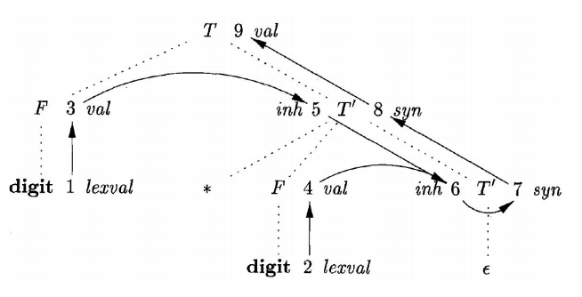

<!--
 * @Github: https://github.com/Certseeds/CS323_Compilers_2020F
 * @Organization: SUSTech
 * @Author: nanoseeds
 * @Date: 2020-11-28 21:10:42
 * @LastEditors: nanoseeds
 * @LastEditTime: 2020-11-28 23:04:41
 * @License: CC-BY-NC-SA_V4_0 or any later version 
 -->

# CS323 Assignment 5

**Name**: nanoseeds  
**SID**: \*\*\*\*\*\*\*\*

## Question 1:

For the SDD in `Figure 1`, give annotated parse trees for the following expressions:

1. (3 + 4) ∗ (5 + 6)n [20 points]
2. 1 ∗ 2 ∗ 3 ∗ (4 + 5)n [20 points]
3. (9 + 8 ∗ (7 + 6) + 5) ∗ 4n [20 points]

| PRODUCTION                           |                   SEMANTIC RULES |
| :----------------------------------- | -------------------------------: |
| $1)\space L \to E \space \textbf{n}$ |                  $L.val = E.val$ |
| $2)\space E \to E_{1} + T$           |      $E.val = E_{1}.val + T.val$ |
| $3)\space E \to T$                   |                  $E.val = T.val$ |
| $4)\space T \to T_{1} * F$           |      $T.val = T_{1}.val * F.val$ |
| $5)\space T \to F$                   |                  $T.val = F.val$ |
| $6)\space F \to (E)$                 |                  $F.val = E.val$ |
| $7)\space F \to \textbf{digit}$      | $F.val = \textbf{digit}.lexval;$ |

Figure 1: Syntax-directed definition of a simple desk calculator

## Answer_of_Question1

## Question 2:

What are all the topological sorts for the dependency graph of `Figure 2`?

One sort mentioned during lecture is 1, 2, 3, . . . , 9 (slide #16 of Chapter 4). [20 points]

   
  
Figure 2: A dependency graph

## Answer_of_Question2

## Question 3:

Below is a grammar for expressions involving operator $+$ and integer or floating-point operands. Floating-point numbers are distinguished by having a decimal point. Give an SDD to determine the type of each term $T$ and expression $E$. [20 points]

$$E \to E + T | T$$
$$T \to \textbf{num} \cdot \textbf{num} | \textbf{num}$$

## Answer_of_Question3

<link rel="stylesheet" type="text/css" href="./../markdown.css">
