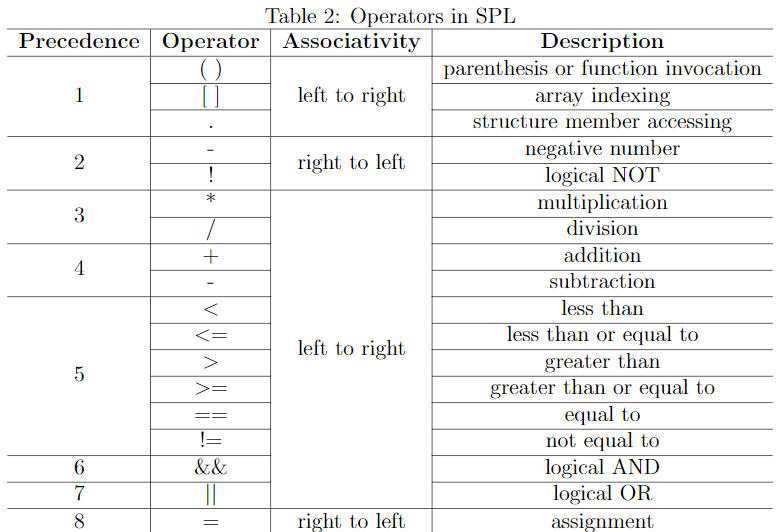

<!--
 * @Github: https://github.com/Certseeds/CS323_Compilers_2020F
 * @Organization: SUSTech
 * @Author: nanoseeds
 * @Date: 2020-09-17 11:48:24
 * @LastEditors: nanoseeds
 * @LastEditTime: 2020-10-03 20:22:40
 * @License: CC-BY-NC-SA_V4_0 or any later version 
 -->

# Project 1-词法分析与语法分析

## Part 1 预览

我们的目标是,通过整个project体系,为SPL(SUSTech Programming Language,一个类C的语言)写出一个编译器;支持一些相似的操作符,并且支持基本的读写操作,虽然砍掉了很多语法,但是还是图灵完备的.

我们希望最后将SPL编译到MIPS32上,project会将其分为 `词法分析与语法分析`,`语义检查`,`中间代码生成`,`目标代码生成`四部分.最后,我们希望编译器编译出来的产物可以在MIPS仿真器上可以运行.

我们提供了拥有全部环境的虚拟机,但是也可以在本机上配置环境,具体请看part 2.

在project1,我们会使用C,基于`GNU flex` && `GNU Bison`, 实现自己的词法,语法解析器.现代的编译器也一般是将词法,语法分析交给它们(lex/flex, yacc/bison)进行自动生成.但是,虽然现成的工具令人不需要太多的理论知识就可以完成project1,但是这并不意味着理论知识不重要(别忘了理论课还有作业),课上将会学习正则表达式,上下文无关语法(后称CFG).项目中主要要进行的是正则表达式的书写.

需要注意的是,这个工作是以后工作的基石,所以,尽量保持代码的可维护性,可拓展性,(以及足够的测试,注释).

## Part 2,Lab环境

### 前言

我们已经提过了,Lab提供了一个配置好环境的Ubuntu 18.04-64bit虚拟机,可以用它开发.但是,本机开发也行.只要拥有以下必要的环境.

+ GCC version 7.4.0
+ GNU Make version 4.1
+ GNU Flex version 2.6.4
+ GNU Bison version 3.0.4
+ Python version 3.6.8
+ urwid (Python module) 2.0.1
+ Spim version 8.0

配置脚本为[enviroment.sh](./enviorment.sh)

<<<<<<< HEAD
#### 虚拟机部分
虚拟机可以在[this](http://10.20.38.233:2333/course/CS323_Compilers_2020F/)下载,login as `student:compiler`
=======
### 虚拟机部分

虚拟机可以在[this](http://10.20.38.233:2333/course/cs323-compilers/)下载,login as `student:compiler`
>>>>>>> project1

## Part 3: 词法分析中的Flex

Flex是一个快速的词法分析器生成器(fast lex).需要指定要匹配的模式以及每个模式匹配之后的操作.Flex会使用文件中的正则表达式,并生成可识别所有模式的组合NFA,然后将其转换为等效的DFA,并尽可能的精简自动机,最后生成 实现词法分析器的C代码. Flex与它的前身Lex(由Lesk和Schmidt设计)相似,并且具有许多相似之处. 尽管我们将在项目中使用Flex,但几乎所有使用的功能都在Lex中提供.

本部分旨在快速介绍Flex,为project提供参考.有关Flex的更多信息,使用`runinfo flex`或阅读文档[page1](https://www.epaperpress.com/lexandyacc/download/flex.pdf)

### 3.1 略

### 3.2 也略

### 3.3更多特性

1. `yylineno`
内置的行数统计器,
在Definitions处添加`%option yylineno`即可使用.

2. `input` && `output`
可以在识别之后,读取缓冲区内的字符.以使用代码解析,而不是写表达式
比如读取注释

``` flex
"//" {char c; while((c=input())) != '\n';}
```

识别到//后,读取到换行符为止,其他的都抛弃.
3. `yytext`,`yylength`,`yyless` and `yymore`
yytext: 本次识别出来的字符.
yylength: yytext的长度.
yyless(int n): 把yytext的yylength-n个字符,放回输入流
yymore: 将下次分析的词汇接在本次的yytext后面.(我感觉像递归)
example字符串:

"And God said,\"Let therebe light,\" and there was light."

``` flex
\"[^\"]*\":{
    if(yytext[yyleng-2] == ’\\’) {
        yyless(yyleng-1);
        yymore();
    } else {
        /* process the string literal */
    }
}
```

识别出来的第一次是"And God said,\",然后(yylength-(yylength-1))=1,"被放回里面,接着是"Let therebe light,\",然后也是放回一个,

### 3.4 手写Lexer

为了实现词法分析器,先读附录A,读取Token和详细解释. 此时应该为Token写正则,您应该为前四个标记编写正则表达式,然后这一步骤的动作比较简单. 在此阶段,工作只是识别每个Token,因此您可以简单地用相应的action打印出Token:

``` flex
"TYPE" {printf("${TYPE} %s\n",yytext);}
```

为了报错,可以用这个兜底规则

``` flex
. { printf("Error type A at Line %d: Unknown characters \’%s\’\ n",yylineno, yytext); }
```

样例1:

``` c
int test_spl(){
    int i = 0,j = 1;
    float i = 1;
}
```

输出

``` log
TYPE int
ID test_spl
LP
RP
LC
TYPE int
ID i
ASSIGN
INT 0
COMMA
ID j
ASSIGN
INT 1
SEMI
TYPE float
ID i
ASSIGN
INT 1
SEMI
RC
```

## Part 4: 基于Bison的语法解析

Bison是一个解析产生器. 通过输入语法规则,生成一个LALR(1)解析器,从而将句子中识别文法.Bison继承自yacc,也许是最常用的LALR生成工具.我们将会使用的语言features只是基础部分.想学习更多知识,可以去Bison的官网: [https://www.gnu.org/software/bison/manual/bison.html](https://www.gnu.org/software/bison/manual/bison.html)

Bison生成的解析器从Flex中获取Token流,随后识别成CFG,默认来说,Bison只是生成一个LALR(1)解析器.Bison内部的实现并不会对Bison自身语法的使用产生影响(TODO).比如说,JTB[http://compilers.cs.ucla.edu/jtb/](http://compilers.cs.ucla.edu/jtb/) 通过Java为JavaCC生成了LL(1)的解析器. 作为编译器设计师,我们要做的只是设计语法及其规范,以及每个生成的Action. 理论上说,即使Bison可以做一些语义分析的工作,但是主要还是用来输出一个语法解析树.

### 4.1 Flex && Bison之间的联系

Bison的整体结构和Flex很相似,都是由声明,定义,产生式和用户程序组成.

``` Bison
%{
Declarations
%}
Definitions
%%
Productions
%%
User subroutines
```

在Bison中,和使用Flex一样,您可以将动作(Action)与模式(Pattern)相关联(或者说产生式,production),这使您可以在解析过程中,使用产生式规约TOken的时候进行任何处理.与Flex不同,可选的Definitions部分是我们在其中配置各种解析器功能的地方,例如定义TOKEN,设定运算符优先级和关联性,以及设置用于在词法分析器和解析器之间进行通信的全局变量.

为了观察Bison是怎么将CFG编译成可执行程序的,我们提供了一个样例,这个样例实现了一个小计算器.

``` Bison
%{
    #include "lex.yy.c"
    void yyerror(const char*);
    int result;
%}
%token INT
%token ADD SUB MUL DIV
%%
Calc: /* empty */
    | Exp { printf("= %d\n",$1); }
    ;
Exp: Factor
    | Exp ADD Factor { $$ = $1 + $3; }
    | Exp SUB Factor { $$ = $1 - $3; }
    ;
Factor: Term
    | Factor MUL Term { $$ = $1 * $3; }
    | Factor DIV Term { $$ = $1 / $3; }
    ;
Term: INT
    ;
%%
void yyerror(const char *s){
    fprintf(stderr, "%s\n", s);
}
int main(){
    yyparse();
    return 0;
}
```

这里main函数只是调用了`yyparse()`函数,`yyparese()`函数又是从yylex中获取Token流.`yyerror()`每当出现无法被规约的时候,error时就会被调用.(PS:但是这个还是需要自己定义而不是预定义).`yyerror()`需要被填充的更加充实一点.

为了使用flex中的`yyflex`,flex编译出来的文件:`lex.yy.c`也被include进来了. 需要注意的是,Declarations声明部分是直接copy到被生成的文件里的,不是什么动态链接.Line5-6里面一定的Token到了最后都会是数字,它们也可以在flex中使用(通常是作为返回值).

所有的预定义Token都是终结符,非终结符是Productions部分定义的. 第一个出现的非终结符被假设为是语法的开始符号.每个rule的定义就是 名字+冒号+ (产生式 {action}){|(产生式 {action})}* +; 默认的action是{$$=$1}. $1,$2,$3指从左向右的ToKen的属性.

因为我们从flex中读取Token流,我们应该将Flex的源代码做一些定制化.

``` Flex
%{
    #include"syntax.tab.h"
%}
%%
[0-9]+ { yylval = atoi(yytext); return INT; }
"+" { return ADD; }
"-" { return SUB; }
"*" { return MUL; }
"/" { return DIV; }
"=" { return EQ; }
. { fprintf(stderr, "unknown symbol: %s\n", yytext); }
```

每个Action中,都最终返回一个给Bison给生成在`syntax.tab.h`里的ToKen,`yylval`是一个Flex预定义变量,将会指示当前Token的属性. 返回值指示Token的属性,`yylval`存储更细节的属性.

至于如何编译,如下的MakeFile

``` Makefile
CC=gcc
FLEX=flex
BISON=bison
.lex: lex.l$(FLEX) lex.l
.syntax: syntax.y
    $(BISON) -t -d syntax.y
calc: .lex .syntax
    $(CC) syntax.tab.c -lfl -ly -o calc.out
clean:
    @rm -f lex.yy.c syntax.tab.* *.out
```

flex和Bison对定义Section只是文本处理,并不会管Include的事情,随后GCC才会处理Include.

最后使用记录如下.

``` log
  echo "1 + 1" | ./calc.out
> = 2
  echo "10 - 2*3" | ./calc.out
> = 4
  echo "92+1c" | ./calc.out
> syntax error
```

### 4.2 Bison的更多细节

#### Token/非终结符的属性

上文中的`yylval`很让人在意,符号的属性被分配给`yylval`,那么问题来了,它的类型为`YYSTYPE`,默认为int,所以上面给int赋值才能成立,但是,每个非终结符和Token的属性都应该被抽象成为语法树的节点,如何是好?

解决方案是重新定义`YYSTYPE`这个宏,换言之,可以使用`#define YYSTYPE float`,这样的语句,来使得每个产生是的返回值都是浮点数.为了支持多种属性,通常情况下都会使用Union来达成目标.

更灵活的方式是直接使用Bison内的%union来更加多样化的指明Token的数据类型.(PS:放到定义部分).下面呢的这个Union将YYSTYPE定义为int,float or char*.

``` Bison
%union{
    int int_value;
    float float_value;
    char * string_value;
}
```

为了指定Token的类型,将Token的定义部分稍作修改,添加进union的字段名称,将特定字段分配给特定的Token,来实现类型的指定.非终结符也可以用%Type来指定类型

``` Bison
%token <int_value> INT
%token ADD SUB MUL DIV
%type <float_value> Exp Factor
```

样例的代码将integer的值赋给INT的Token,将一个Exp Factor的式子赋予一个floating-point的value,操作符并没有被赋予数据类型(它们也并不需要存储属性).

#### 符号的位置

计算器样例中已经展现了$n来访问每个符号(这里的定义是Token|nonterminal),可以访问产生式中的符号.(PS:但是和直觉不一样,n是从右到左数的).

而且还可以使用@n来访问符号的位置信息,和$n比较类似.

+ $n 指代一个YYSTYPE类型的变量, `yylval` 里面存储了符号的属性.
+ @n 指代一个YYLTYPE类型的变量, `yylloc` 里面存储了符号的位置.

YYLTYPE类型的定义包括出现的第一行,第一列,以及出现的最后一行,最后一列.是一个预定义的类型,但是不会自动更新,需要在Flex中进行管理.

Flex中的自定义内容大概如此:首先在头部插入

``` Flex
%{
    int yycolno = 1;
    #define YY_USER_ACTION \
        yylloc.first_line = yylineno; \
        yylloc.first_column = yycolno; \
        yylloc.last_line = yylineno; \
        yylloc.last_column = yycolno + yyleng; \
        yycolno += yyleng;
%}
```

这里面的`yycolno`是自己维护的变量,需要每次在换行的时候被重置.

``` flex
"\n" {yycolno = 1;}
```

YY_USRE_ACTIOn宏将会在每次TOKEN识别完毕之后被触发(PS:默认是空)

#### 解决语法冲突

语法可能是模棱两可的,Bison不会直接抛出异常,而是会在表中记录所有潜在的冲突,并用自己的规则去处理.

+ 对于Shift/Reduce的冲突,优先选的Shift.
+ 对于Reduce/Reduce的冲突,优先选择先声明的Reduce.

当然,这样模糊的规则并不是很好,有可能带来不可预料的事件.应该直接指明规则. 比如指定优先级和关联性.(可以参考附录C2)

举例来讲,计算器样例内,如果变成

``` Bison
Exp: INT
    | Exp ADD Exp
    | Exp SUB Exp
    | Exp MUL Exp
    | Exp DIV Exp
    ;
```

那么编译的时候就会出现警告`syntax.y: warning: 16 shift/reduce conflicts [-Wconflicts-sr]`

这个时候,显而易见,计算顺序根本就没有被考虑

``` log
echo "3 * 4 + 5" | ./calc.out
  > = 27
echo "5 + 3 * 4" | ./calc.out
  > = 17
```

为了理解为什么会出现这种状况,考虑一下为什么shift/reduce的冲突会出现.

+ 对第一个表达式,3*4进入栈之后,随之而来的是+5,这个时候可以选择规约(使用Exp-> Exp MUL Exp)或者shift,把ADD符号读进去. 这个时候总是会选择Shift,所以就把 ADD 5给读了进去.然后,4+5被使用了`Exp -> Exp ADD Exp`,随后又是一个规约,所以就规约成了27.

为了解决这个问题,通过定义

``` Bison
%left ADD SUB
%left MUL DIV
```

来指示运算符的优先级和结合性-左结合,先结合MUL DIV再结合ADD SUB.
(PS: 同样,%right指代右结合,%nanossoc指代非关联运算符).以及顺序指示了识别优先级,越向下的优先级越高.

通过优先级和关联性的分配可以解决冲突,对于Shift/Reduce冲突,如果要Shift的Token优先级高于Reduce的Token,那就Shift,否则就Reduce.规则的优先级由右侧最右边的终止符的优先级确定. 比如栈上`5+3`,下一个Token是MUL,MUL>ADD,所以先Shift. 如果是`3*4`在栈上,那么ADD < MUL, 先Reduce.但是,如果是`5+3`,下一个Token也是+(平级的情况).关联性就会决定,左结合就Reduce,右结合就Shift.

产生式的关联性也可以通过%prec显式的定义,%prec和一个终结符一起放在最后,就说明这个产生式和此终结符一个优先级. 这个在右边没有终结符的时候还是挺有用的,虽然说Bison有默认的解决冲突办法,但是这个功能还是可以减少因其他原因而引起的Shift/Reduce冲突警告(SPL 规范中也有).

#### 异常处理/错误恢复

Bison通过提供特殊的`error`Token来支持`error`恢复. 当Bison生成的解析器遇到`error`时,它将触发以下`error`恢复流程：

1. 调用`yyerror`报告功能(一般重写)
2. 弹出所有未还原的Token,直到可以消除`error`为止
3. Shift error,然后丢弃Token,直到一个TOKEN可以在`error`之后被推送(re-synchronization4).
4. 如果可以成功转换三个符号,就继续分析,否则,返回到步骤2

要从`error`状态中恢复,应将`error`放在正确的上下文中. 例如,以下恢复模式可帮助解析器从缺少分号,右大括号或右括号的程序中恢复.

``` Bison
stmt：Exp error
CompSt：LC DefList StmtList error
Exp：ID LP Args error
```

然而,将`error` TOKEN放在哪里更像一门艺术,而不是科学:将`error`的程度调高往往会保护您免受各种`error`的侵害,而将`error`降低至较低的水平可以减少要丢弃的Token数量. 对于构造编译器来说,合理的做法是将`error`放在语句结束之前,并使用标点符号作为同步Token. 另一种做法是在语法规范中添加错误的产生式, 从而让解析器区识别并匹配这些非法的产生式.错误恢复更多的是反复尝试,看看到底哪一个方式才能既清楚的报告错误又能正常的恢复.

### 4.3 解析器实现

解析器的实现比词法分析器难得多,所以,必须仔细阅读,认真理解,尽可能地处理潜在的语法冲突和错误.

强烈建议的是,一开始对所有的匹配什么都不做,语法正确就推出,语法错误就输出个错误-不做多余的事情.随后,再把冲突解决掉,错误恢复一下.

为了确保编译器的顺利编译和正确运行,可以增加一些方便debug的trick.

+ 编译.y文件的时候使用-v 选项, 生成一个`syntax.output`的文件,其将说明LALR自动机的状态和转换.

+ 在编译.y的时候使用-t,然后再调用yyparse之前添加一句`yydebug=1;`来激活解析器的输出.

完成了这些之后,再在action中构造语法树. 和在Listing-3中做的一样. 对于非终结符,对符号节点的属性$$赋值,随后一个一个的插入子节点(PS,比如insert($$,$n)这样的函数,或者可变构造函数). 对于终结符来说,对yylval赋值,如何使用参考Listing-4.

打印语法树可以实现为根节点的遍历,在面向对象的设计范式里,打印应该是node类型的成员函数,而不是mian函数去调用.

## Part 5: Project的需求

### 解析器的需求

#### 基础需求

这个解析器接受一个命令行参数-文件的路径. 输出一个语法上有效的语法解析树,或者输出并警告现有的词法/语法错误.并且,应该提供一个MakeFile脚本,其中的splc构建target应当编译出最后的解析器,然后将其移动到bin目录.

举例来说 Makefile在project1文件夹下,在这个文件夹下,使用`make splc`,生成的文件为`bin/splc`,随后`bin/splc test_test_1_r01.spl`就应该输出语法树,随后用diff去判断正确性.

#### 详细需求

解析器应该既能识别词法错误,又能识别语法错误.

+ 词法错误(Error Type A),出现了未定义的字符或者Token,符号以数字开头等.

+ 语法错误(Error Type B),出现了非法的结构,比如括号不对称.应该尽量寻找到多一点的词法错误.

对一个语法上有效的程序,应当输出语法树,比如下面的代码,没有语法错误(但是有语义上的错误,c没有定义就使用了).

``` c
int test_1_r01(int a,int b){
    c = 'c';
    if(a>b){
        return a;
    }else{
        return b;
    }
}
```

输出应当是

``` ast
Program (1)
  ExtDefList (1)
    ExtDef (1)
      Specifier (1)
        TYPE: int
      FunDec (1)16
        ID: test_1_r01
      LP
      VarList (1)
        ParamDec (1)
          Specifier (1)
            TYPE: int
          VarDec (1)
            ID: a
        COMMA
        VarList (1)
          ParamDec (1)
            Specifier (1)
              TYPE: int
            VarDec (1)
              ID: b
      RP
    CompSt (2)
    LC
    StmtList (3)
      Stmt (3)
        Exp (3)
          Exp (3)
            ID: c
          ASSIGN
          Exp (3)
            CHAR: 'c'
        SEMI
      StmtList (4)
        Stmt (4)
          IF
          LP
          Exp (4)
            Exp (4)
              ID: a
            GT
            Exp (4)
              ID: b
          RP
          Stmt (5)
            CompSt (5)
              LC
              StmtList (6)
                Stmt (6)
                  RETURN
                  Exp (6)
                    ID: a
                  SEMI
              RC
          ELSE
          Stmt (9)
            CompSt (9)
            LC
            StmtList (10)
              Stmt (10)
                RETURN
                Exp (10)
                  ID: b
                SEMI
            RC
    RC
```

而一个出现了语法错误与词法错误的样例如下

``` c
int test_1_r03()
{
    int i = 0,j=1;
    float i = $;
    if (i < 9.0){
        return 1
    }
    return @;
}
```

输出如下

``` log
Error type A at Line 4: Mysterious lexeme $
Error type B at Line 7: Missing semicolon ’;’
Error type A at Line 8: Mysterious lexeme @
```

上面的语法错误中的行数,第七还是第六都没问题,不准确并无大碍.

此外要支持的还有

+ 支持integer的16进制表示,比如`0x114514`,同时将非法的16进制数字,比如`0xBlackTea`报为词法错误.

+ 支持字符的16进制表示,比如`\x90`, 将非法字符比如`\xt0`报为词法错误.

#### Bonus需求

如果实现了(并且自己添加了测试用例并能显示可以正常工作),那么可以拿到bonus.

+ 单行,多行注释.
+ 宏预处理
+ 文件包含
+ for循环

### 自己的测试用例

自己写五个符合SPL语法的测试用例输入和输出来测评其他同学的解析器.五个测试用例应该总起来至少有两个A error 和两个B error. 样例将会给出.
只要遵循SPL语法,无论程序多么复杂都可以(当然,输入,输出都得给出,缺一不可).

这些测试用例都会用于评分!

### 给分政策

最高一百,加了bonus也不会高于100.分数取决于通过的测试用例,自己测试用例的质量与报告的质量.

+ basic 测试用例(已经给出的)占80.
+ 自己的测试用例(以及通过他人的测试用例)占10分.
+ 报告10分.

Bouns内容独立评测,最高20.

## Part 6: 如何提交

直接把文件夹压缩成zip提交上去,结构如下

``` log
StudentID-project1/  
  bin/
    splc    // generated
  report/
    StudentID-project1.pdf
  test/
    test_StudentID_1.spl
    test_StudentID_1.out
    test_StudentID_2.spl
    test_StudentID_2.out
    ...     // your self-written testcases
  test-ex/
    test_1.spl
    test_1.out
    ...     // your extra testcases
  Makefile
  ...         // C/Flex/Bison source code
```

+ bin目录包含一个名为splc的可执行文件,该文件是由Makefile中的splc target生成的.确保它在我们的环境中正常工作(参见Part2)

+ report目录包含一个pdf文件,该文件说明了您的设计和实现,您应该关注已实现的可选/附加功能,因为所需的部分相当简单明了.您的报告不应超过4页,建议您对主要内容使用11pt字体大小和单行间距.

+ test目录是您自己编写的测试用例.确保将输出文件包括在目录中,该目录记录了遵循输出要求的消息(第5.1.2节)
  + 代码文件名应以.spl结尾
  + 输出文件名应以.out结尾.
  + 请记住在文件名中包含ID.

+ test-ex存放所有额外的测试用例.我们不会使用这些测试用例来评估其他同学的解析器.它们的唯一目的只是检查解析器的Bonus功能.

+ 提供了Makefile.您可以添加任何目标,但是最重要的是,必须确保splc target可以编译并在bin目录中生成单个可执行文件splc.否则,我们将无法评估解析器,而此项目将获得0分.

+ 在这个项目中,您将使用$C/Flex/Bison$编写代码,您可以将它们直接放置在提交的目录下,也可以放置在单独的文件夹下,例如src and include.同样,确保代码可以成功编译.

DDL前提交分数不会有区别,DDL后一周内,打85折;1-2周内,70折;再晚,0分.

## Part 7: 资源

Here we list some links that you may find useful information during this course.

+ C language tutorial:<http://www.stat.cmu.edu/~brian/cprog.html>
+ Simple Makefile tutorial:<http://www.cs.colby.edu/maxwell/courses/tutorials/maketutor/>
+ Compiler tools (Flex & Bison) introduction:<http://dinosaur.compilertools.net/>
+ Flex & Bison introduction:<https://aquamentus.com/flex_bison.html>
+ Stanford University CS143 Compilers:<https://web.stanford.edu/class/archive/cs/cs143/cs143.1128>
+ GNU C Compiler Internals/GNU C Compiler Architecture:<https://en.wikibooks.org/wiki/GNU_C_Compiler_Internals/GNU_C_Compiler_Architecture>
+ Buffer Overflow Exploit - Dhaval Kapil:<https://dhavalkapil.com/blogs/Buffer-Overflow-Exploit/>
+ Assemblers, Linkers, and the SPIM Simulator:<http://pages.cs.wisc.edu/~larus/HP_AppA.pdf>
+ Kempe’s  graph-coloring  algorithm<https://www.cs.princeton.edu/~appel/Color.pdf21>

## Part end: 附录

### A Token 规范

遵守下面的规则就能轻松的使用Flex来构建Lexer,前四个需要手动补全.

``` flex
INT     ->  /* integer in 32-bits (decimal or hexadecimal) */
FLOAT   ->  /* floating point number (only dot-form) */
CHAR    ->  /* single character (printable or hex-form) */
ID      ->  /* valid identifier */
TYPE    ->  int | float | char
STRUCT  ->  struct
IF      ->  if
ELSE    ->  else
WHILE   ->  while
RETURN  ->  return
DOT     ->  .
SEMI    ->  ;
COMMA   ->  ,
ASSIGN  ->  =
LT      ->  <
LE      ->  <=
GT      ->  >
GE      ->  >=
NE      ->  !=
EQ      ->  ==
PLUS    ->  +
MINUS   ->  -
MUL     ->  *
DIV     ->  /
AND     ->  &&
OR      ->  ||
NOT     ->  !
LP      ->  (
RP      ->  )
LB      ->  [
RB      ->  ]
LC      ->  {
RC      ->  }
```

### B 语法规范

``` Bison
/* high-level definition */
Program -> ExtDefList

ExtDefList -> ExtDef ExtDefList
    | $

ExtDef -> Specifier ExtDecList SEMI
    | Specifier SEMI
    | Specifier FunDec CompSt

ExtDecList -> VarDec
    | VarDec COMMA ExtDecList

/* specifier */
Specifier -> TYPE
    | StructSpecifier

StructSpecifier -> STRUCT ID LC DefList RC
    | STRUCT ID

/* declarator */
VarDec -> ID
    | VarDec LB INT RB

FunDec -> ID LP VarList RP
    | ID LP RP

VarList -> ParamDec COMMA VarList
    | ParamDec

ParamDec -> Specifier VarDec

/* statement */
CompSt -> LC DefList StmtList RC

StmtList -> Stmt StmtList
    | $

Stmt -> Exp SEMI
    | CompSt
    | RETURN Exp SEMI
    | IF LP Exp RP Stmt
    | IF LP Exp RP Stmt ELSE Stmt
    | WHILE LP Exp RP Stmt

/* local definition */
DefList -> Def DefList
    | $

Def -> Specifier DecList SEMI

DecList -> Dec
    | Dec COMMA DecList

Dec -> VarDec
    | VarDec ASSIGN Exp

/* Expression */
Exp -> Exp ASSIGN Exp
    | Exp AND Exp
    | Exp OR Exp
    | Exp LT Exp
    | Exp LE Exp
    | Exp GT Exp
    | Exp GE Exp
    | Exp NE Exp
    | Exp EQ Exp
    | Exp PLUS Exp
    | Exp MINUS Exp
    | Exp MUL Exp
    | Exp DIV Exp
    | LP Exp RP
    | MINUS Exp
    | NOT Exp
    | ID LP Args RP
    | ID LP RP
    | Exp LB Exp RB
    | Exp DOT ID
    | ID
    | INT
    | FLOAT
    | CHAR

Args -> Exp COMMA Args
    | Exp
```

### C Additions

#### C1 Tokens

已经在附录A中列出了SPL的Token规范.您需要为前四个Token编写正则表达式,其余的Token对应于箭头右侧指定的词素. (除了TYPE可以是int,floatorchar之一),在此,我们提供有关Token的更多详细信息.

+ INT表示UINT32.您可以假定它们始终在32位范围内.我们有两种类型的整数文字,十进制(以10为底)和十六进制(以16为底)形式.十进制形式的整数词素是连续的数字0-9序列,它不能以"0"开头,但0本身除外.十六进制整数词素始终以"0x"或"0X"开头,后跟一系列十六进制数字[0-9a-f],同样,数字序列不能以"0"开头,但0x0本身除外.

+ FLOAT表示无符号浮点数:IEEE-754标准中的floating-point number.您可以假设它们始终采用有效的单精度格式.我们不考虑用数字的10尾数和指数表示的科学计数法.有效的浮点数始终包含单个点字符(即"."),并且点的两边上都必须始终有数字

+ CHAR表示一对单引号中包含的单个字符.我们不考虑由转义序列表示的那些字符,例如"\n"(换行符)或"\t"(水平制表符).

+ ID代表foridentifier,由3种类型的字符组成：下划线(_),数字[0-9]和字母[a-zA-Z].有效的标识符不能以数字开头.您可以假定标识符的长度不会超过32.

#### C2 语法规则

在这里,我们解释每组产生式的一般定义.

在实现解析器之前,您应该了解每个产生式的含义.

+ `High-level  definition`指定SPL程序的顶级语法,包括全局变量声明和函数定义.
+ `Specifier`与类型系统相关,在SPL中,我们具有基本类型(int,float & char)和结构类型.
+ `Declarator`声明符定义变量和函数声明. 请注意,数组类型由声明器指定.
+ `Statement`声明指定几种程序结构,例如分支结构或循环结构. 它们大多用花括号括起来,或以分号结尾.
+ `Statement`局部定义包括局部变量的声明和赋值.
+ `Expression`表达式可以是单个常量,也可以是对变量的运算. 请注意,这些运算符具有优先级和关联性,如表2所示.

<div>
  <br />
  <div>Fig.1</div>
</div>


### C3 注释

您可以选择实现您的编译器以支持注释. SPL的注释样式有两种类型,单行注释和多行注释.单行注释以两个斜杠"//"开头,所有符号都跟在后面,直到词法分析器将删除换行符为止.多行注释 以"/\*"开头,然后以第一个"\*/"结尾. 请注意,多行注释不能嵌套,即,您不能在" /\*"和"\*/"之间放置另一个多行注释.

<style type="text/css">
div{
  text-align: center;
}
div>div {
  text-align: center;
  border-bottom: 1px solid #d9d9d9;
  display: inline-block;
  padding: 2px;
}
div>img{
  border-radius: 0.3125em;
  box-shadow: 0 2px 4px 0 rgba(34,36,38,.12),0 2px 10px 0 rgba(34,36,38,.08);
}
</style>
